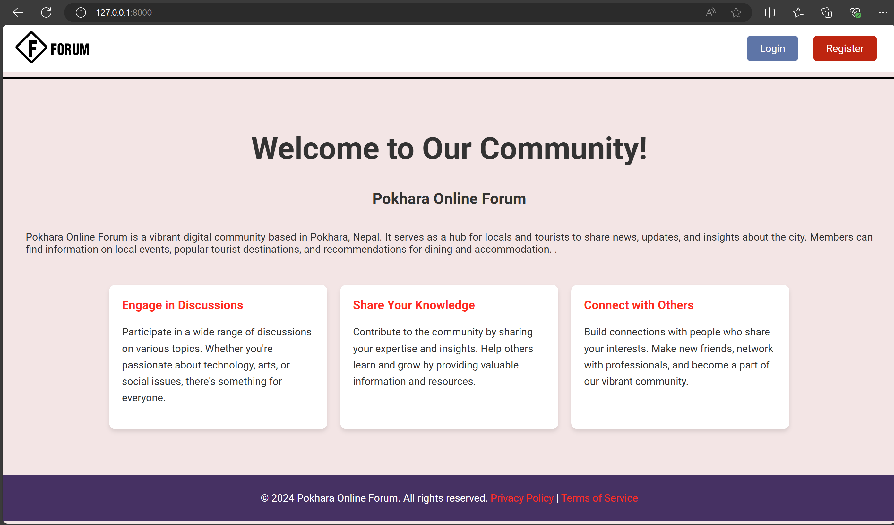
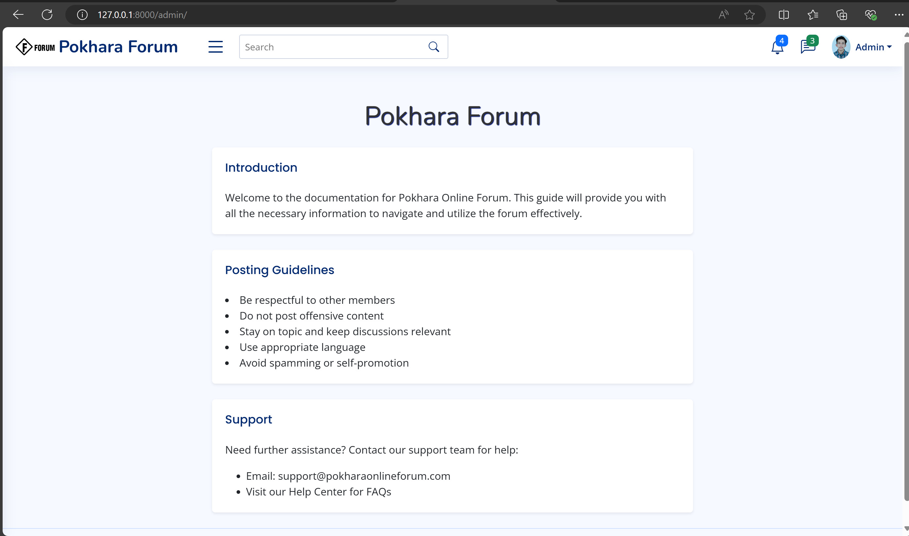

An online forum, also known as a message board or discussion board, is a virtual platform where users can engage in discussions, share information, ask questions, and interact with each others

1.Welcome Page :  
Welcome to our online forum! Engage in insightful discussions, share your knowledge, and connect with like-minded individuals from around the world. We're excited to have you as part of our vibrant community!

2.Login Page:  
A login page is a gateway for users to access a website or application securely. It typically requires users to enter their username and password to authenticate their identity. This process ensures that only authorized users can access sensitive information or personalized services.

3.Register Page:  
A registration page is the first step for new users to create an account on a website or application. It typically collects essential information such as username, email address, and password, and may include additional fields like full name, phone number, or security questions.

4.Home Page:  
A home page serves as the main entry point for a website, providing visitors with an overview of its content and features. It often includes navigation menus, featured content, and links to important sections like About, Contact, and Services. The home page is designed to capture the visitor's attention, offering a clear and visually appealing layout that guides users to their desired information. It reflects the site's branding and purpose, creating a welcoming and intuitive experience for both new and returning users.

5.Admin-Management Page  

The admin management section of a website or application is a secure area where administrators can oversee and control various aspects of the platform. This typically includes user management, content moderation, and system settings. Admins can add, edit, or remove users, assign roles and permissions, and manage content such as posts, comments, and media. The admin management area is designed to be robust and user-friendly, ensuring that administrators can efficiently maintain and enhance the platform's functionality and security.
